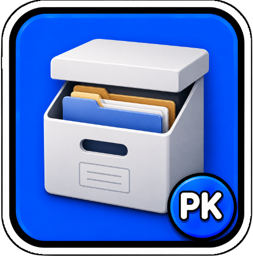

# PKarchives



[🇫🇷 FR](README.md) · [🇬🇧 EN](README_en.md)

Archive du Bureau vers Google Drive via rclone, avec interface macOS et interface CLI/TUI.

## Structure

```text
src/
├── macos/       # Application SwiftUI/menu bar
├── cli/         # Application Go/TUI
└── shared/      # Script d'archivage commun

release/
├── macos/       # PKarchives.app
└── cli/         # Binaire pkarchives
```

## ✅ Fonctionnalités

- Menu bar native macOS (SwiftUI)
- Interface CLI/TUI Go
- Upload vers Google Drive via rclone
- Archivage par mois automatique (`YYYY_MM_mois`)
- Suppression auto après upload
- Support fichiers et dossiers
- Barre de progression en temps réel

## 🧠 Utilisation

### Premier setup (automatisé)

```bash
./setup.sh
```

Le script interactif vous guide pour :
1. Saisir votre Google Drive Folder ID
2. Configurer le dossier à archiver (défaut : `~/Desktop`)
3. Définir le remote rclone (défaut : `gdrive`)
4. Vérifier que rclone est installé et configuré
5. Build et lancer l'app

### Lancer l'app

```bash
open release/macos/PKarchives.app
```

### Lancer la version CLI/TUI

```bash
./release/cli/pkarchives
```

### Script manuel

```bash
./src/shared/archive.sh files      # Fichiers seulement
./src/shared/archive.sh all        # Fichiers + dossiers
```

## ⚙️ Configuration

La configuration est générée automatiquement par `setup.sh` dans `secrets/.env`.

### Variables disponibles

| Variable | Défaut | Description |
|----------|--------|-------------|
| `PKARCHIVES_DRIVE_FOLDER_ID` | *(obligatoire)* | ID du dossier Google Drive |
| `PKARCHIVES_DESKTOP_PATH` | `~/Desktop` | Dossier à archiver |
| `PKARCHIVES_DESKTOP_LINK_NAME` | `DesktopArchive` | Symlink à exclure |
| `PKARCHIVES_RCLONE_REMOTE` | `gdrive` | Nom du remote rclone |

Après l'archivage, Google Drive est monté dans Finder et le symlink `DesktopArchive` est créé sur le Bureau.

## 🧾 Prérequis

- macOS 14.0+
- rclone (`brew install rclone`)
- Remote rclone configuré

## 📦 Build

```bash
./build.sh
```

## 📋 Voir le [CHANGELOG](CHANGELOG.md) pour l'historique complet

## 🔗 Liens

- [Google Drive](https://drive.google.com)
- [rclone](https://rclone.org/)
