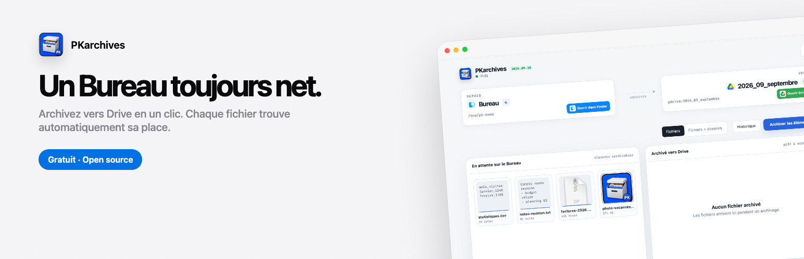
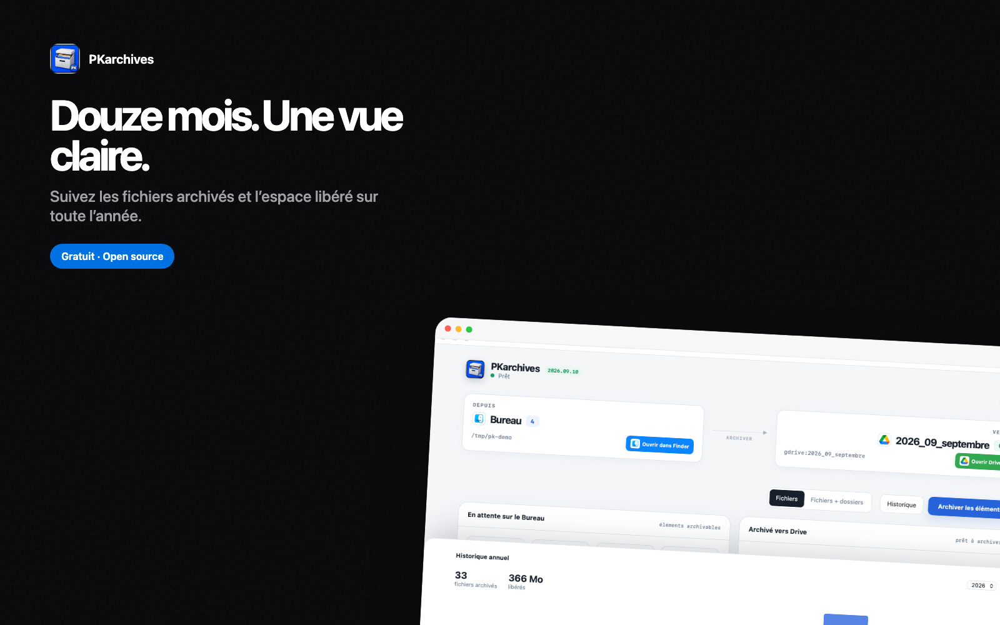

# PKarchives



[🇫🇷 FR](README.md) · [🇬🇧 EN](README_en.md)

**Version : 2026.10.6** · [Changelog](CHANGELOG.md)

Archive du Bureau vers Google Drive via rclone, avec interface macOS et interface CLI/TUI.





## Structure

```text
src/
├── macos/       # Application SwiftUI/menu bar
├── cli/         # Application Go/TUI
└── shared/      # Script d'archivage commun

release/
├── macos/       # PKarchives.app
└── cli/         # Binaire pkarchives
```

## ✅ Fonctionnalités

- Menu bar native macOS (SwiftUI)
- Interface CLI/TUI Go
- Upload vers Google Drive via rclone
- Archivage par mois automatique (`YYYY_MM_mois`)
- Suppression auto après upload
- Support fichiers et dossiers
- Barre de progression en temps réel

## 🧠 Utilisation

### Premier setup (automatisé)

```bash
./scripts/setup.sh
```

Le script interactif vous guide pour :
1. Saisir votre Google Drive Folder ID
2. Configurer le dossier à archiver (défaut : `~/Desktop`)
3. Définir le remote rclone (défaut : `gdrive`)
4. Vérifier que rclone est installé et configuré
5. Build et lancer l'app

### Lancer l'app

```bash
open release/macos/PKarchives.app
```

### Lancer la version CLI/TUI

```bash
./release/cli/pkarchives
```

### Script manuel

```bash
./src/shared/archive.sh files      # Fichiers seulement
./src/shared/archive.sh all        # Fichiers + dossiers
```

## ⚙️ Configuration

La configuration est générée automatiquement par `scripts/setup.sh` dans `secrets/.env`.

### Variables disponibles

| Variable | Défaut | Description |
|----------|--------|-------------|
| `PKARCHIVES_DRIVE_FOLDER_ID` | *(obligatoire)* | ID du dossier Google Drive |
| `PKARCHIVES_DESKTOP_PATH` | `~/Desktop` | Dossier à archiver |
| `PKARCHIVES_DESKTOP_LINK_NAME` | `DesktopArchive` | Nom du volume monté |
| `PKARCHIVES_RCLONE_REMOTE` | `gdrive` | Nom du remote rclone |
| `PKARCHIVES_AUTO_MOUNT` | `1` | Monter le Drive automatiquement au lancement (`0` pour désactiver) |

Le Drive est monté dans `~/DesktopArchive` (volume Finder « DesktopArchive », volontairement hors du Bureau pour que la suppression des fichiers du Bureau ne puisse jamais traverser vers le Drive). Le montage est tenté automatiquement au lancement de l'app, puis après chaque archivage réussi.

## 🧾 Prérequis

- macOS 14.0+
- rclone (`brew install rclone`)
- Remote rclone configuré

## 📦 Build

```bash
./scripts/build.sh
```

## 📋 Voir le [CHANGELOG](CHANGELOG.md) pour l'historique complet

## 🔗 Liens

- [Landing](store/index.html) · [film de présentation](store/videos/ultracrea2-promo.mp4) · [anciennes versions](store/archive)
- [Google Drive](https://drive.google.com)
- [rclone](https://rclone.org/)
- ❤️ Soutenir ce projet sur [Ko-fi](https://ko-fi.com/pouark)
