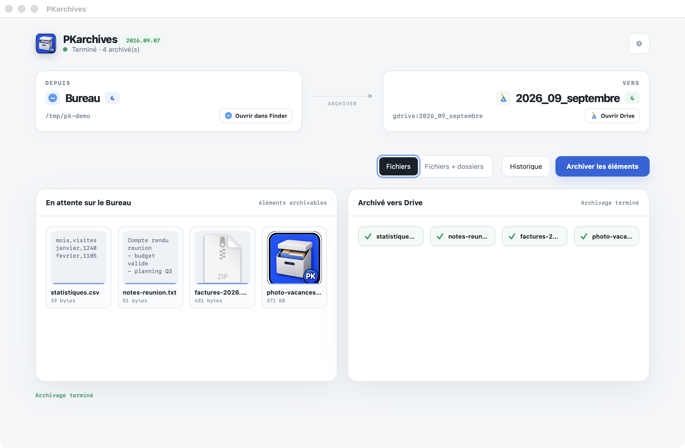
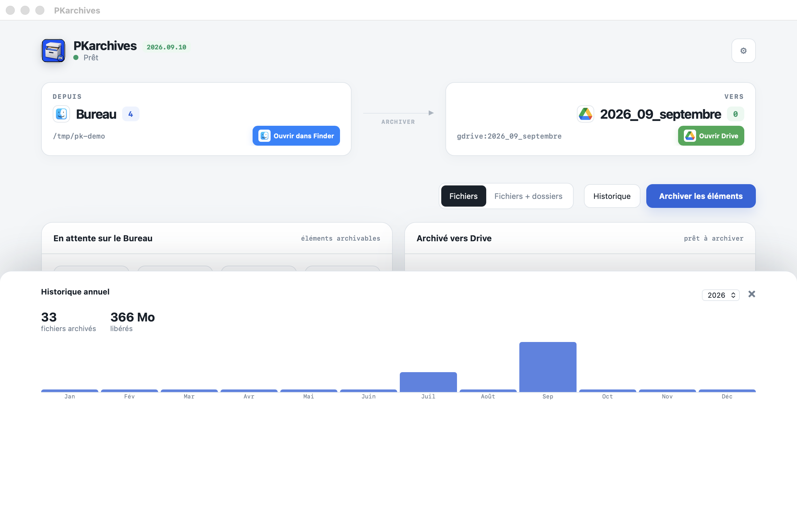

# PKarchives


[🇫🇷 FR](README.md) · [🇬🇧 EN](README_en.md)

Archive your Desktop to Google Drive via rclone, with a macOS app and a CLI/TUI.





## Structure

```text
src/
├── macos/       # SwiftUI/menu bar app
├── cli/         # Go/TUI application
└── shared/      # Shared archive script

release/
├── macos/       # PKarchives.app
└── cli/         # pkarchives binary
```

## ✅ Features

- Native macOS menu bar (SwiftUI)
- Go CLI/TUI interface
- Upload to Google Drive via rclone
- Automatic monthly archiving (`YYYY_MM_month`)
- Auto-delete after upload
- Files and folders support
- Real-time progress bar

## 🧠 Usage

### First-time setup (automated)

```bash
./setup.sh
```

The interactive script guides you through:
1. Entering your Google Drive Folder ID
2. Configuring the folder to archive (default: `~/Desktop`)
3. Setting the rclone remote name (default: `gdrive`)
4. Verifying rclone is installed and configured
5. Building and launching the app

### Launch the app

```bash
open release/macos/PKarchives.app
```

### Launch the CLI/TUI

```bash
./release/cli/pkarchives
```

### Manual script

```bash
./src/shared/archive.sh files      # Files only
./src/shared/archive.sh all        # Files + folders
```

## ⚙️ Configuration

Configuration is automatically generated by `setup.sh` in `secrets/.env`.

### Available variables

| Variable | Default | Description |
|----------|---------|-------------|
| `PKARCHIVES_DRIVE_FOLDER_ID` | *(required)* | Google Drive folder ID |
| `PKARCHIVES_DESKTOP_PATH` | `~/Desktop` | Folder to archive |
| `PKARCHIVES_DESKTOP_LINK_NAME` | `DesktopArchive` | Symlink to exclude |
| `PKARCHIVES_RCLONE_REMOTE` | `gdrive` | rclone remote name |

After archiving, Google Drive is mounted at `~/DesktopArchive` and a `DesktopArchive` link is created on the Desktop pointing to it.

## 🧾 Requirements

- macOS 14.0+
- rclone (`brew install rclone`)
- rclone remote configured

## 📦 Build

```bash
./build.sh
```

## 📋 See [CHANGELOG](CHANGELOG.md) for full history

## 🔗 Links

- [Google Drive](https://drive.google.com)
- [rclone](https://rclone.org/)
