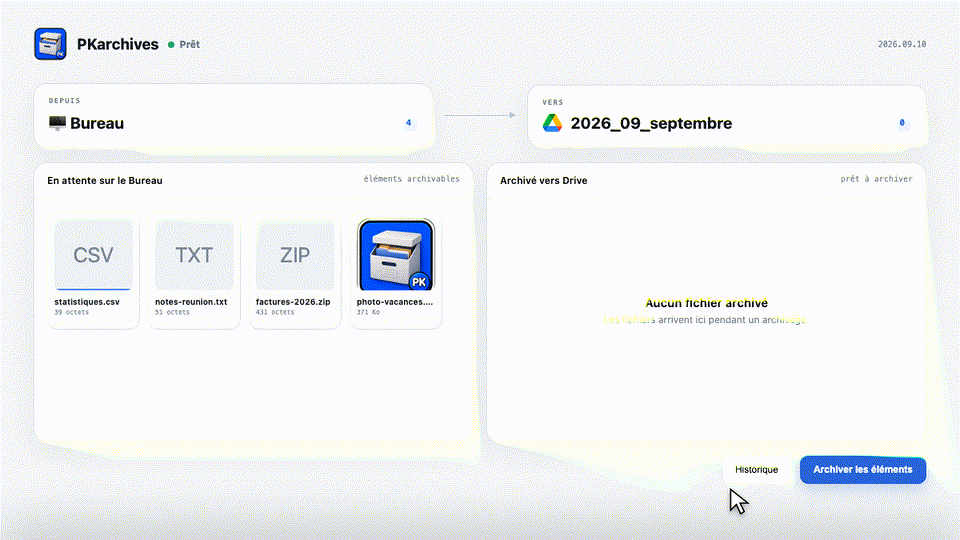
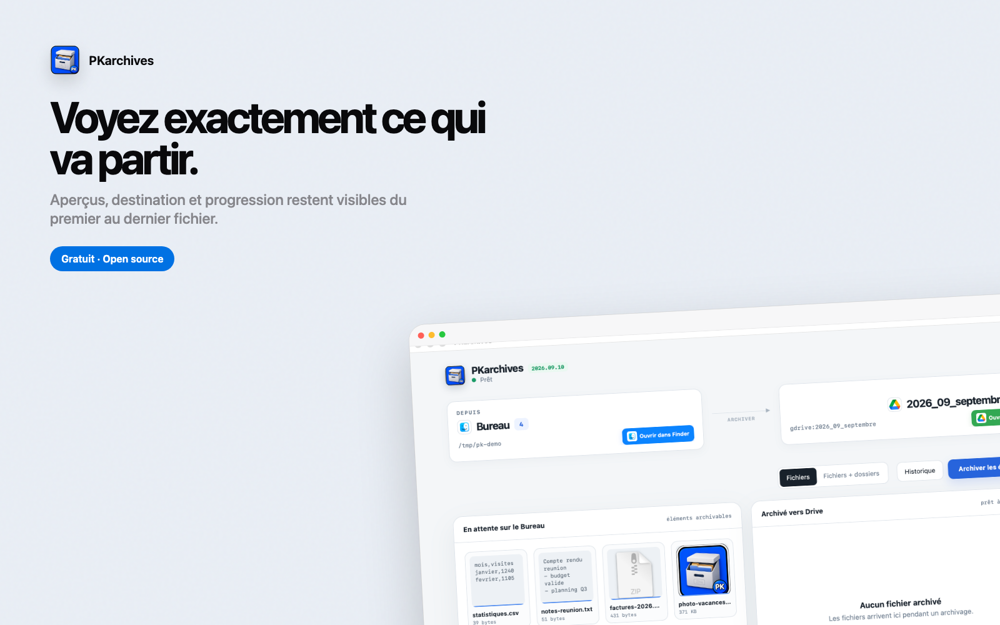

# PKarchives


[🇫🇷 FR](README.md) · [🇬🇧 EN](README_en.md)

**Project version: 2026.10.34** · Available app: 2026.10.30 · [Changelog](CHANGELOG.md) · [MIT License](LICENSE)

Archive your Desktop to Google Drive via rclone, with a macOS app and a CLI/TUI.



## Structure

```text
src/
├── macos/       # SwiftUI/menu bar app
├── cli/         # Go/TUI application
└── shared/      # Shared archive script

release/
├── macos/       # PKarchives-<YYYY.MM.PATCH>.app
└── cli/         # pkarchives binary
```

## ✅ Features

- Native macOS menu bar (SwiftUI)
- Go CLI/TUI interface
- Upload to Google Drive via rclone
- Automatic monthly archiving (`YYYY_MM_month`)
- Auto-delete after upload
- Files and folders support
- Real-time progress bar
- Native settings with search, language selection, PK project library, support, and version information
- About compares the installed app with the latest Stable and Dev builds, showing per-channel status and manually checking a freshly fetched feed
- Dedicated Credits & Inspirations settings section linking to tools, dependencies, and reference projects



## 🧠 Usage

### First-time setup (automated)

```bash
./scripts/setup.sh
```

The interactive script guides you through:
1. Entering your Google Drive Folder ID
2. Configuring the folder to archive (default: `~/Desktop`)
3. Setting the rclone remote name (default: `gdrive`)
4. Verifying rclone is installed and configured
5. Building and launching the app

### The app

After installing from the DMG or `.pkg` (see below), the app lives in the menu bar.
To build it yourself: `./scripts/build.sh`.


## Installation — Apple Silicon Mac

- **DMG**: [Download PKarchives for Mac](https://github.com/mondary/Macos_PKarchives/releases/latest/download/PKarchives.dmg), then open the DMG and drag the app to Applications.
- **Direct installer**: [Download the .pkg installer](https://github.com/mondary/Macos_PKarchives/releases/latest/download/PKarchives.pkg), then double-click the file.
- **Homebrew**: `brew install --cask mondary/tap/pkarchives`
- **curl**: `curl -fL https://github.com/mondary/Macos_PKarchives/releases/latest/download/PKarchives.pkg -o "$HOME/Downloads/PKarchives.pkg"`

The published build targets Apple Silicon (arm64). The app and installer are not notarized; macOS may ask you to approve the installation and first launch.

### CLI/TUI, from anywhere in Terminal

Run this once, then use `pkarchives` from any folder:

```bash
curl -fsSL https://raw.githubusercontent.com/mondary/Macos_PKarchives/main/scripts/install-cli.sh | sh
pkarchives
```

## ⚙️ Configuration

Configuration is automatically generated by `scripts/setup.sh` in `secrets/.env`.

### Available variables

| Variable | Default | Description |
|----------|---------|-------------|
| `PKARCHIVES_DRIVE_FOLDER_ID` | *(required)* | Google Drive folder ID |
| `PKARCHIVES_DESKTOP_PATH` | `~/Desktop` | Folder to archive |
| `PKARCHIVES_DESKTOP_LINK_NAME` | `DesktopArchive` | Mounted volume name |
| `PKARCHIVES_RCLONE_REMOTE` | `gdrive` | rclone remote name |
| `PKARCHIVES_AUTO_MOUNT` | `1` | Mount the Drive automatically at launch (`0` to disable) |

The Drive is mounted at `~/DesktopArchive` (Finder volume “DesktopArchive”, deliberately outside the Desktop so Desktop cleanup can never traverse into the Drive). Mounting is attempted automatically at app launch, then after every successful archive run.

## 🧾 Requirements

- macOS 14.0+
- rclone (`brew install rclone`)
- rclone remote configured

## 📦 Build

```bash
./scripts/build.sh
```

## License

PKarchives is distributed under the [MIT License](LICENSE), which permits commercial use and redistribution provided the copyright and license notice are retained.

## 📋 See [CHANGELOG](CHANGELOG.md) for full history

## 🔗 Links

- [Landing page](store/website/index.html) · [product film](store/media/ultracrea2-promo.mp4) · [previous versions](store/archive)
- [Google Drive](https://drive.google.com)
- [rclone](https://rclone.org/)
- ❤️ Support this project on [Ko-fi](https://ko-fi.com/pouark)
